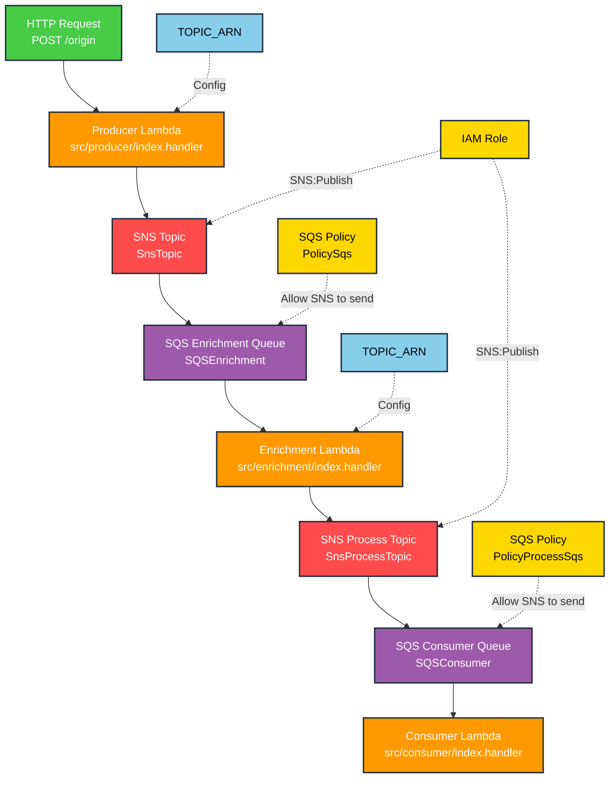

# Lambda SNS Enrichment SQS Lambda

Este proyecto demuestra una arquitectura serverless avanzada utilizando AWS Lambda, SNS y SQS para crear un pipeline de procesamiento de mensajes con capacidades de enriquecimiento de datos.

## Descripción de la Arquitectura

La aplicación implementa un pipeline de procesamiento de tres pasos:

1. **Producer Lambda** - Recibe peticiones HTTP y publica mensajes a SNS
2. **Enrichment Lambda** - Procesa mensajes desde SQS, enriquece los datos y publica a otro topic de SNS
3. **Consumer Lambda** - Recibe mensajes enriquecidos desde SQS para el procesamiento final

## Flujo de Arquitectura

```
HTTP Request → Producer Lambda → SNS Topic → SQS Queue → Enrichment Lambda → SNS Process Topic → SQS Consumer Queue → Consumer Lambda
```

## Diagrama de Arquitectura



## Funciones Lambda

### Producer Function
- **Handler**: `src/producer/index.handler`
- **Trigger**: HTTP POST `/origin`
- **Propósito**: Recibe peticiones entrantes y las publica al topic inicial de SNS

### Enrichment Function
- **Handler**: `src/enrichment/index.handler`
- **Trigger**: Mensajes SQS desde la cola de enriquecimiento
- **Propósito**: Procesa mensajes, añade datos enriquecidos y publica al topic de proceso

### Consumer Function
- **Handler**: `src/consumer/index.handler`
- **Trigger**: Mensajes SQS desde la cola de consumo
- **Propósito**: Maneja el procesamiento final de mensajes enriquecidos

## Recursos AWS

### Topics SNS
- **SnsTopic**: Topic inicial para mensajes sin procesar
- **SnsProcessTopic**: Topic para mensajes enriquecidos

### Colas SQS
- **SQSEnrichment**: Cola para mensajes en espera de enriquecimiento
- **SQSConsumer**: Cola para mensajes enriquecidos en espera de procesamiento final

### Permisos
- Permisos de publicación SNS para ambos topics
- Políticas SQS que permiten a SNS enviar mensajes a las colas

## Variables de Entorno

- `TOPIC_ARN`: ARN del topic SNS para publicar mensajes (configurado automáticamente via CloudFormation)

## Uso

### Despliegue

Despliega el servicio usando Serverless Framework:

```bash
serverless deploy
```

### Testing

Envía una petición POST al endpoint `/origin`:

```bash
curl -X POST https://tu-api-gateway-url/dev/origin \
  -H "Content-Type: application/json" \
  -d '{
    "name": "Sergio",
    "email": "sergio@email.com",
    "countryISO": "PE"
  }'
```

### Ejemplo de Petición

También puedes usar el archivo `requests.http` incluido para probar la API:

```http
post https://yhf4xbnf4g.execute-api.us-east-1.amazonaws.com/dev/origin
Content-Type: application/json

{
  "name": "Sergio",
  "email": "sergio@email.com",
  "countryISO": "PE"
}
```

### Monitoreo

Puedes monitorear el flujo de mensajes a través de:
- CloudWatch Logs para cada función Lambda
- Métricas de colas SQS en la consola de AWS
- Métricas de topics SNS en la consola de AWS

## Desarrollo Local

Para desarrollo local, usa el comando dev del Serverless Framework:

```bash
serverless dev
```

Esto iniciará un emulador local y creará un túnel de peticiones hacia AWS Lambda.

## Estructura del Proyecto

```
├── src/
│   ├── producer/
│   │   └── index.ts          # Función Lambda Producer
│   ├── enrichment/
│   │   └── index.ts          # Función Lambda Enrichment
│   └── consumer/
│       └── index.ts          # Función Lambda Consumer
├── serverless.yml            # Configuración de Serverless
├── package.json              # Dependencias del proyecto
├── requests.http             # Ejemplos de peticiones HTTP
└── README.md                 # Este archivo
```

## Tecnologías Utilizadas

- **AWS Lambda**: Servicio de computación serverless
- **Amazon SNS**: Simple Notification Service para mensajería pub/sub
- **Amazon SQS**: Simple Queue Service para colas de mensajes
- **Serverless Framework**: Despliegue de infraestructura como código
- **TypeScript**: Lenguaje de programación
- **Node.js 20.x**: Entorno de ejecución
- **AWS SDK v3**: Cliente para servicios AWS

## Configuración

El servicio está configurado con:
- **Runtime**: Node.js 20.x
- **Stage**: `dev` (configurable)
- **Region**: `us-east-1`
- **Build**: ESBuild con exclusión del AWS SDK para bundles más pequeños

## Flujo de Datos

1. Una petición HTTP llega al **Producer Lambda**
2. El Producer publica el mensaje al **SNS Topic**
3. SNS envía el mensaje a la **SQS Enrichment Queue**
4. El **Enrichment Lambda** procesa el mensaje, lo enriquece con datos adicionales
5. El Enrichment Lambda publica el mensaje enriquecido al **SNS Process Topic**
6. SNS envía el mensaje enriquecido a la **SQS Consumer Queue**
7. El **Consumer Lambda** procesa el mensaje final

## Notas Importantes

- La entrega de mensajes en crudo está habilitada para ambas suscripciones SQS
- El proceso de enriquecimiento añade metadatos a los mensajes entrantes
- Todas las funciones registran sus eventos para depuración
- Los roles IAM se crean automáticamente con los permisos mínimos requeridos
- El proyecto utiliza TypeScript para mayor seguridad de tipos
